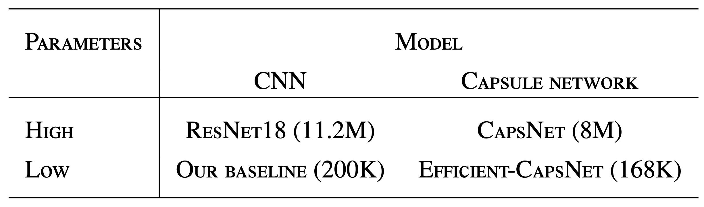
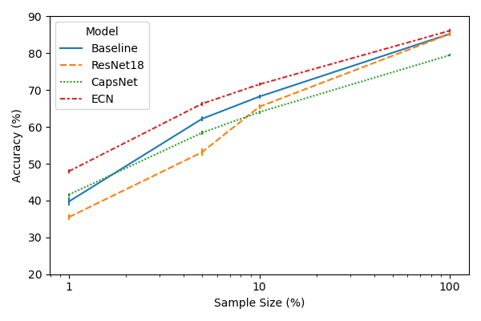
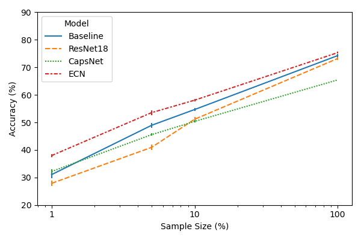
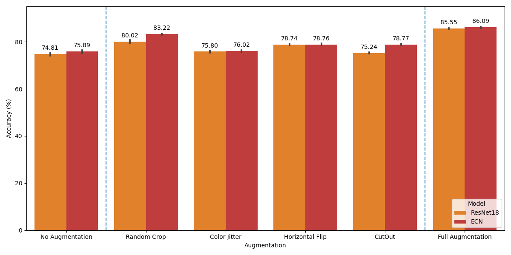
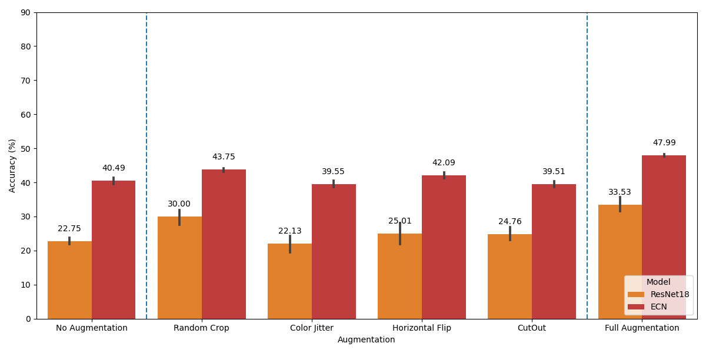
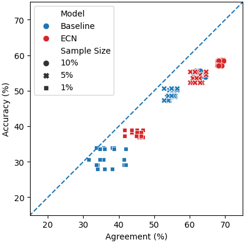
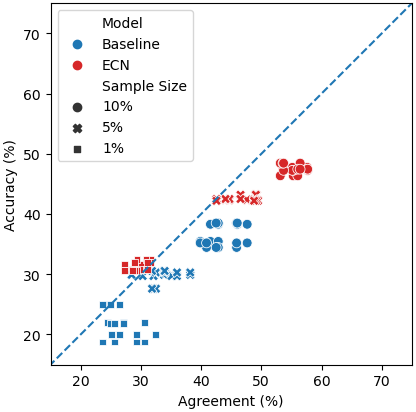

# Is Efficient-CapsNet the solution to medical imaging challenges in developing countries?

## Report

Find the full report [here](https://github.com/ben-j-barlow/caps-net-project/blob/main/report_G080.pdf).

## Abstract

Current state-of-the-art for medical imaging, convolutional neural networks, require computationally  intense training routines and very large datasets. A shortage of field experts to provide expert annotations and a lack of computing resource makes it difficult to adopt new methods in developing countries. [Hinton et al., 2011](https://link.springer.com/chapter/10.1007/978-3-642-21735-7_6) and [Sabour et al., 2017](https://arxiv.org/pdf/1710.09829.pdf) proposed capsule networks to overcome the limitations with existing CNN approaches. A recent implementation, Efficient-CapsNet, uses self-attention to enhance routing and uses an extremely low number of parameters. We believe the architecture could be  scaled in developing countries to ensure computer  vision decreases, rather than increases, global inequality. We present the first investigation into the generalization of Efficient-CapsNet when challenges  commonly found in medical datasets are imposed on  training data; namely, number of samples is limited.  We find Efficient-CapsNet to outperform our low parameter CNN baseline in terms of classification  accuracy and distribution generalization, in all data settings. The 0.83% gap between classification accuracy increases to a gap of 8.39% when samples used  in training is reduced by a factor of 100. Our implementation for this report’s experiment is available at https://github.com/ben-j-barlow/caps-net-project.

## Experiment

We compared the performance of capsule networks and CNNs in a low-parameter-small-data setting.

* ResNet18 offered a common (high-parameter) CNN benchmark.
* Our baseline offered a low-parameter CNN baseline.
* CapsNet ([Sabour et al., 2017](https://arxiv.org/pdf/1710.09829.pdf)) offered a high-parameter capsule network benchmark.
* Efficient-CapsNet ([Mazzia
et al., 2021](https://www.nature.com/articles/s41598-021-93977-0)) was the low-parameter capsule network that formed the main focus of our experiment.



## Result

The results are obtained using the CIFAR-10 test set.

### Overall

We observed that Efficient-CapsNet outperformed all other models in all data settings (in terms of classification accuracy).



[Recht et al. (2018; 2019)](https://arxiv.org/abs/1806.00451) argues that because CIFAR10’s validation set has been widely benchmarked, prior models have unintentionally overfit to the original test set because performance has been optimized w.r.t. the original test set itself. We reproduced the above graph using a brand new test set proposed by the authors and found Efficient-CapsNet to be superior in terms of accuracy again.



### Ablation

Using the entire training set, we performed an ablation study on our low-parameter Efficient-CapsNet and a high-parameter ResNet18 (which is commonly trained using augmentation in the literature). Interestingly, Efficient-CapsNet still benefited from data augmentations despite capsule networks being designed to alleviate the need for augmentation. In particular, we see that geometric data augmentation (random crop) achives the best augmentation gains.



When trained on only 1% of the training samples (60 per class), we observed that Efficient-CapsNet significantly outperformed ResNet18 in terms of generalization. Again, full augmentation strategies outperformed the no augmentation strategy for the Efficient-CapsNet model.



### Agreement

For an explanation of distributional generalization and agreement, please see the full report [here](https://github.com/ben-j-barlow/caps-net-project/blob/main/report_G080.pdf).

With full augmentation, we observed that as the sample size is reduced, Efficient-CapsNet obtains superior distributional generalization over its low-parameter CNN counterpart.



Without data augmentation, the same results are observed. In fact, Efficient-CapsNet with 1% training data (60 training examples) outperforms our baseline with 5% training data (300 training examples) and has better coupling between the accuracy and the pairwise agreement.




## Guide

To run the code, we have provide some examples to build the model in the blueprint folder. Command example to run the Efficient-CapsNet blueprint with five trials, 10% sample, and data sampling without replacement is shown below.

```
python main.py \
    --blueprint blueprint/efficient-capsnet-with-decoder-full-aug.yaml \
    --experiment-name efficient-capsnet-with-decoder-full-aug-ten-percent-sample \
    --num-trial 5 \
    --sample-percentage 0.1 \
    --independent
```