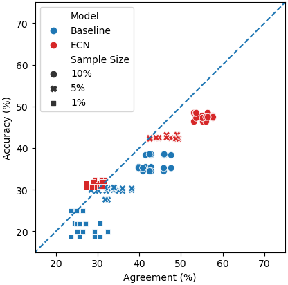

# Is Efficient-CapsNet the solution to medical imaging challenges in developing countries?

## Abstract

Current state-of-the-art for medical imaging, convolutional neural networks, require computationally  intense training routines and very large datasets. A shortage of field experts to provide expert annotations and a lack of computing resource makes it difficult to adopt new methods in developing countries. (Hinton et al., 2011; Sabour et al., 2017) proposed capsule networks to overcome the limitations with existing CNN approaches. A recent implemen tation, Efficient-CapsNet, uses self-attention to en-hance routing and uses an extremely low number of parameters. We believe the architecture could be  scaled in developing countries to ensure computer  vision decreases, rather than increases, global inequality. We present the first investigation into the generalization of Efficient-CapsNet when challenges  commonly found in medical datasets are imposed on  training data; namely, number of samples is limited.  We find Efficient-CapsNet to outperform our low parameter CNN baseline in terms of classification  accuracy and distribution generalization, in all data settings. The 0.83% gap between classification accuracy increases to a gap of 8.39% when samples used  in training is reduced by a factor of 100. Our imple-mentation for this report’s experiment is available at https://github.com/ben-j-barlow/caps-net-project.

## Model Description

Overall architecture for the CapsNet are a shown in the figure below. In summary, we initially do the same convolution as a normal CNN would, then we transform the final result into capsule representation in the PrimaryCaps layer. Afterwards we then project it into different transformations and do routing.


## Result

### Overall

For our overall result, we observe that Efficient-CapsNet did not have a decrease in accuracy as the dataset sample is reduced on the original CIFAR-10 test set.


We also observe that this also follows in the latest test set. We found that across our models, we observe a decrease over 10% accuracy between the original and new test set.


### Ablation

We evaluate Efficient-CapsNet with a ResNet18 for the ablations on the original test set. Although we observe less gains when using augmentations compared to ResNet18, we see that Efficient-CapsNet still able to leverage data augmentations. In particular, we see that geometric data augmentation like random crop achives the best augmentation gains.


When given only 1% data to train, we observe that Efficient-CapsNet are still able to generalize better to the original test set. We also observe that with full augmentation, Efficient-CapsNet are able to leverage data augmentation better compared to ResNet18.


### Agreement

We observe that as the sample size is reduced, the baseline we used does not coupled as well as the Efficient-CapsNet.


Without data augmentation, we observed that a Efficient-CapsNet with 1% training data outperforms our baseline with 5% training data and having better coupling between the accuracy and the pairwise agreement.




## Guide

To run the code, we have provide some examples to build the model in the blueprint folder and example to do training on the shell scripts we have defined. Command example to run the Efficient-CapsNet blueprint with five trials, 10% sample, and data sampling without replacement is shown below.

```
python main.py \
    --blueprint blueprint/efficient-capsnet-with-decoder-full-aug.yaml \
    --experiment-name efficient-capsnet-with-decoder-full-aug-ten-percent-sample \
    --num-trial 5 \
    --sample-percentage 0.1 \
    --independent
```